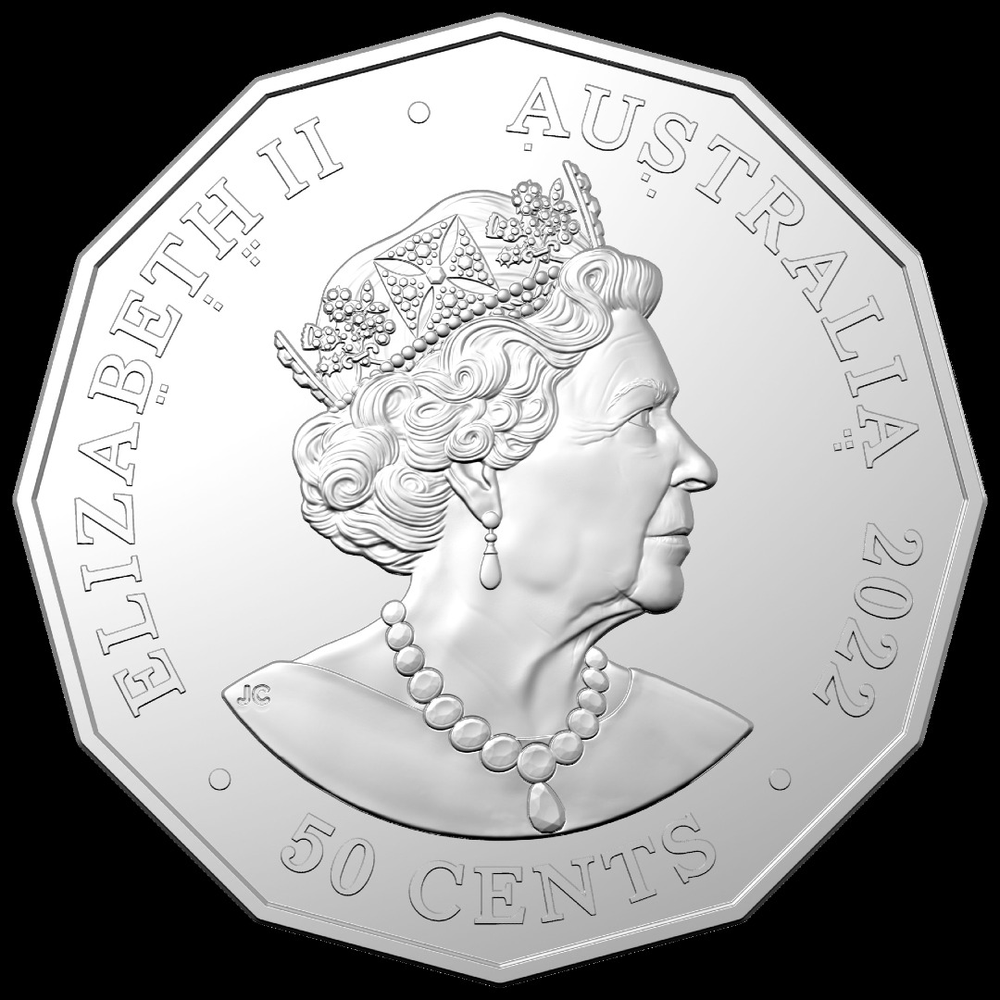
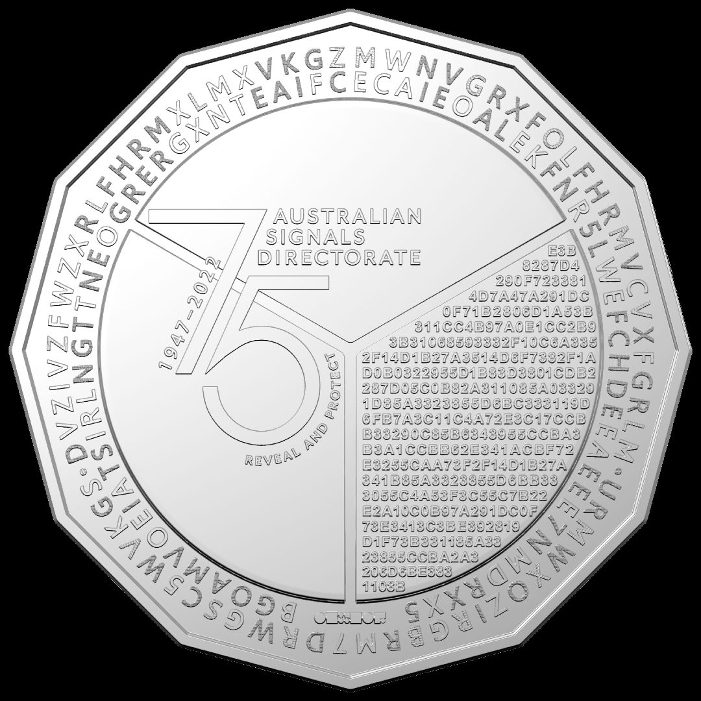

<div align="center">
<h1 align="center">ASD 75th Anniversary Commemorative Coin Challenge</h1>
  <br />
   
  
  <br />
  <br />
  <p><i>Click on the Levels to show solutions.</i></p>
</div>

<details><summary><h2>Level 1</h2></summary><p>
      
  
  
  On the heads side of the coin, the symbols below the letters are in Braille. 
  Reading the letters by their numbered order gives **```ATBASH```**.
  
</p></details>

<details><summary><h2>Level 2</h2></summary><p>
  
  The clue from Level 1 refers to the ATBASH cipher. On the tails side, the letters in the outer ring are separated by ○ into 2 segments.

  >DVZIVZFWZXRLFHRMXLMXVKGZMWNVGRXFOLFHRMVCVXFGRLM
  
  >URMWXOZIRGBRM7DRWGSC5WVKGS

  Decoding the text using this tool (https://www.dcode.fr/atbash-cipher) gives:

  >WEAREAUDACIOUSINCONCEPTANDMETICULOUSINEXECUTION
  
  >FINDCLARITYIN7WIDTHX5DEPTH
  
  Adding proper spacing, the text reads **```WE ARE AUDACIOUS IN CONCEPT AND METICULOUS IN EXECUTION FIND CLARITY IN 7 WIDTH X 5 DEPTH```**

  Decoding the inner ring results in gibberish, we will come back to it later.
  
</p></details>

<details><summary><h2>Level 3</h2></summary><p>
  
   ```FIND CLARITY IN 7 WIDTH X 5 DEPTH```, this is a clue to a Caesar Box Cipher. 
  
  Now we take the text from the inner ring and fill a table of size 7x5, filling in the letters from left to right gives us two tables.

<div>
<table>
<tr>
<td>
  
| B | G | O | A | M | V | O |
|---|---|---|---|---|---|---|
| E | I | A | T | S | I | R |
| L | N | G | T | T | N | E |
| O | G | R | E | R | G | X |
| N | T | E | A | I | F | C |

</td>  

<td>
  
| E | C | A | I | E | O | A |
|---|---|---|---|---|---|---|
| L | E | K | F | N | R | 5 |
| L | W | E | F | C | H | D |
| E | E | A | E | E | E | 7 |
| N | M | D | R | X | X | 5 |

</td>  
</tr>
</table>
</div>
  
Reading the tables horizontally gives **```BELONGING TO A GREAT TEAM STRIVING FOR EXCELLENCE WE MAKE A DIFFERENCE XOR HEX A5D75```**.
  
</p></details>

<details><summary><h2>Level 4</h2></summary><p>
  
  Text block on the tails side:
  >E3B8287D4290F7233814D7A47A291DC0F71B2806D1A53B311CC4B97A0E1CC2B93B31068593332F10C6A3352F14D1B27A3514D6F7382F1AD0B0322955D1B83D3801CDB2287D05C0B82A311085A033291D85A3323855D6BC333119D6FB7A3C11C4A72E3C17CCBB33290C85B6343955CCBA3B3A1CCBB62E341ACBF72E3255CAA73F2F14D1B27A341B85A3323855D6BB333055C4A53F3C55C7B22E2A10C0B97A291DC0F73E3413C3BE392819D1F73B331185A3323855CCBA2A3206D6BE3831108B
  
  The previous clue tells us to XOR this text block with the key ```A5D75```. XOR keys must be in byte(s) (1 byte = 2 hex characters), so we double up the key to ```A5D75A5D75``` for an even number of hex characters. Decoding the text using this tool (https://www.dcode.fr/xor-cipher) gives:
  
  **```For 75 years the Australian Signals Directorate has brought together people with the skills, adaptability and imagination to operate in the slim area between the difficult and the impossible.```**
  
</p></details>

<details><summary><h2>Bonus Level</h2></summary><p>
  
  The inner and outer rings of text are coloured differently. 
  
  Legend:
  | Font On Coin | Formatting Style |
  | --- | --- |
  | Light | Regular |
  | Dark | **Bold** |
  | Striped | ~~Strikethrough~~ |
  
  Inner Ring:
  
  >B**GOAMV**OE**I**A**TS**IRL**NGT**T**NE**O**GRER**GXNT**EAI**F**C**ECA**IE**O**AL**EK**FN**R**5L**WE**FCHDE**EA**EE**E**7N**MDRXX5
  
  The inner ring is encoded in binary, the presence of only two colours is a hint. A common character encoding is ASCII, each character corresponds to a numerical value. Only 7 bits is needed to encode the alphabet in the ASCII table. 
  
  Light characters = 1, Dark characters = 0:
  >1000001101001110001001000011110001011100100110010011000001100100110010
  
  Decoding with this tool (https://www.dcode.fr/ascii-code) gives **```ASDCbr2022```**.
  
  Outer Ring:
  >~~ZM~~W**NV**~~G~~**RXF**~~O~~L**FHR**~~M~~**V**C~~V~~**X**F**GR**~~L~~M○**UR**~~M~~**W**~~X~~**O**Z**I**~~R~~G~~B~~**R**M7**D**~~R~~**W**G~~S~~**C**5**W**~~V~~K**G**S~~○~~**D**VZIV~~Z~~FWZX**R**~~L~~**FHRM**X~~L~~MX**VKG**
  
  The outer ring is encoded in Morse Code. Striped letters provided clue to being spaces in Morse Code because no consecutive striped letters bar one exception at the top (ZM), which is also a hint to start reading from there. Converting characters to Morse Code with light characters as dots, dark characters as dashes and striped characters as spaces:
  >-.. ... -... .- .-.. -... . .-. - .--. .- .-. -.- .---- ----. ....- --...
  
  Decoding with this tool (https://www.dcode.fr/morse-code) gives **```DSBALBERTPARK1947```**. This is consistent with inner ring’s format of [Organisation][Place][Date] as well.
  
</p></details>
